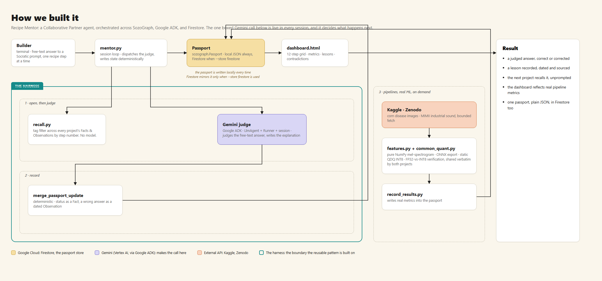

# Recipe Mentor

A Collaborative Partner agent, built on
[SozoGraph](https://github.com/Sozo-Analytics-Lab/sozograph)
([PyPI](https://pypi.org/project/sozograph/)). Give it a problem and a
Kaggle dataset and a real Google ADK agent fetches the data, figures out
what kind of task it is, and samples it for real findings -- class
balance, image dimension spread, sample-rate consistency. Before it
configures anything, it puts a real decision to you: a concrete
preprocessing or hyperparameter choice, grounded in what it just found and
in what past projects in this lab learned the hard way, with options and a
recommendation, not a rhetorical question. Then it trains, quantizes,
verifies, and records, deciding what to call and when. It asks one more
question after it finishes for feedback, and it recalls what tripped it up
on one project, unprompted, the moment a related project starts. You can
also just ask it, in plain language, what's been tried so far and what's
worth exploring next.

**Try it live: [recipe-mentor-web-186891137448.us-central1.run.app](https://recipe-mentor-web-186891137448.us-central1.run.app)**
-- hosted on Cloud Run, bring your own Kaggle credentials, nothing to
install. See "Autonomous agent mode" below.

Built for the "All Things Agentic" hackathon's Collaborative Partner track.
The pattern generalizes. Any structured, repeatable workflow, and any real
work worth delegating, can sit on top of the same pieces: a portable
memory passport, a deterministic tag-based recall layer, and a real agent
with real tools. Fork this as a template for that shape of agent.

## What's actually being demonstrated

1. **Persistent memory, zero schema changes.** Recipe-step progress,
   metrics, and licence checks live as `Fact`s in an existing SozoGraph
   `Passport`. Lessons live as dated `Observation`s. No fork of the library.
2. **Deterministic recall.** `recall.py` filters facts and observations by
   a fixed tag (`step:NN`). No embedding similarity, no vector store. The
   thing being recalled belongs to a known, closed structure, a recipe's
   own step numbers.
3. **A real autonomous agent, not a chat loop.** `agent_runner.py` gives a
   Google ADK agent real tools: fetch a Kaggle dataset, detect its task
   type, configure hyperparameters, train and quantize and verify, record
   the result. The agent decides what to call and when. It asks one
   clarifying question before it starts and one for feedback after it
   finishes, so the answer shapes this run and the feedback shapes the
   next one. See "Autonomous agent mode" below.
4. **A real agent framework judging real answers, too.** `llm.py`'s
   `AdkJudge` runs a second ADK agent (`LlmAgent` + `Runner` + session)
   against Gemini 3.5, for the Socratic path. It genuinely evaluates
   whether a free-text answer satisfies a stated rule.
5. **Real pipelines behind every project.** A maize leaf-disease CNN and a
   MIMII-based generator-fault autoencoder, hand-built for the two demo
   cards. Generic versions of both, `generic_image_train.py` and
   `generic_audio_anomaly_train.py`, back the autonomous path for any
   Kaggle dataset matching either shape. All four trained, quantized, and
   verified end to end against real data. See
   `docs/ADR_Recipe_Mentor_Pipelines_2026-08-29.md` and
   `docs/ADR_Recipe_Mentor_Autonomous_Agent_2026-08-30.md`.

## Architecture



```
 mentor.py (Socratic session loop)         agent_runner.py (autonomous agent loop)
   |                                          |
   |-- recipe.py    12-step recipe, data      |-- agent/toolkit.py   fetch/detect/configure/train/record
   |-- projects/*.py  two hand-authored       |-- agent/detect.py    dataset-shape detection
   |     project cards                        |-- agent/bounds.py    hyperparameter clamp ranges
   |-- recall.py    cross-project tag lookup  |-- projects/dynamic.py  ProjectCard authored from
   |-- llm.py         AdkJudge  (--backend adk)|      the problem statement + detected task type
   |-- firestore_store.py  (--store firestore) |-- llm.py             AgentRunner: LlmAgent + tools=[...]
   |                                          |
   +------------------ both write into -------+
                            |
                            v
 sozograph.Passport  <-->  passports/lab_demo.json  (always mirrored locally)
                      <-->  Firestore (recipe-mentor DB, when --store firestore)
                            |
                            v
 dashboard/render_dashboard.py --> dashboard.html   (every project's step grid, metrics, lessons, contradictions)

 pipelines/
   common_quant.py                 shared ONNX export + static QDQ INT8 + verification
   features.py                      pure NumPy + soundfile mel-spectrogram (no librosa)
   kaggle_fetch.py                   whole-dataset fetch via the Kaggle API (agent path)
   fetch_mimii.py                    bounded MIMII subset via Zenodo range requests (maize/diesel_generator)
   maize_train.py / mimii_anomaly.py         the two hand-built demo pipelines
   generic_image_train.py / generic_audio_anomaly_train.py   the same pipelines, generalized for any
                                               matching Kaggle dataset (agent path)
   record_results.py                writes each demo pipeline's report.json into the passport
```

## Quickstart

No GCP account, no API key, no ML libraries. This is the whole mechanism
running deterministically.

```bash
git clone https://github.com/rapha18th/recipe-mentor.git
cd recipe-mentor
pip install sozograph

python -m recipe_mentor.mentor --project maize --show-recipe

# a full interactive session, keyword-heuristic judge
python -m recipe_mentor.mentor --project maize
# start a second, unrelated project. watch it recall the first session's lessons
python -m recipe_mentor.mentor --project diesel_generator

python -m recipe_mentor.dashboard.render_dashboard
# open recipe_mentor/dashboard.html in a browser
```

`passports/lab_demo.json` is the shared passport both sessions read and
write. Delete it to start clean. It's plain JSON. Open it directly to see
what got recorded.

## Full setup

Real ADK judge, real Firestore store, real pipelines.

### 1. Install

```bash
pip install -r requirements.txt
```

### 2. A GCP project with Gemini 3.5+ access via Vertex AI

Use your own project. The one this was built against carries no usable
access for anyone else. Three environment variables point everything at
it. Each has a fallback, and the fallback is this build's own project.

```bash
export RECIPE_MENTOR_GCP_PROJECT=your-project-id
export RECIPE_MENTOR_GCP_LOCATION=global   # try global first; some Gemini 3.5 access is global-endpoint-only
export RECIPE_MENTOR_MODEL=gemini-3.5-flash
```

```bash
gcloud auth login
gcloud auth application-default login
gcloud config set project "$RECIPE_MENTOR_GCP_PROJECT"
gcloud services enable aiplatform.googleapis.com --project="$RECIPE_MENTOR_GCP_PROJECT"
```

If `gemini-3.5-flash` 404s on your chosen location, that's a real,
documented failure mode. See "Model name and location" below.

Kaggle credentials, for `maize_train.py`'s dataset: put a `kaggle.json`
API token at `~/.kaggle/kaggle.json` (from
[kaggle.com/settings](https://www.kaggle.com/settings) → API →
"Create New Token").

```bash
python -m recipe_mentor.mentor --project maize --backend adk
python -m recipe_mentor.mentor --project diesel_generator --backend adk
```

### 3. Firestore as the passport store (optional)

```bash
export RECIPE_MENTOR_FIRESTORE_DATABASE=recipe-mentor
gcloud services enable firestore.googleapis.com --project="$RECIPE_MENTOR_GCP_PROJECT"
gcloud firestore databases create \
  --database="$RECIPE_MENTOR_FIRESTORE_DATABASE" \
  --location=us-central1 --type=firestore-native \
  --project="$RECIPE_MENTOR_GCP_PROJECT"
```

Create a dedicated database. If the project already has other services on
it, don't reuse an existing default database blind. This build hit a real
incompatibility connecting to a pre-existing Enterprise-edition default
database: a 404, despite `gcloud` confirming it existed and IAM being
correct. A fresh Standard-edition database worked immediately. See
`docs/ADR_Recipe_Mentor_ADK_Firestore_2026-08-29.md`.

```bash
python -m recipe_mentor.mentor --project maize --backend adk --store firestore
```

The local `passports/lab_demo.json` mirror is written on every save,
regardless of `--store`. The dashboard and `record_results.py` work
unchanged either way.

### 4. The ML pipelines

```bash
python -m recipe_mentor.pipelines.fetch_mimii        # ~615MB, bounded subset via HTTP range requests
python -m recipe_mentor.pipelines.mimii_anomaly       # real training, ~5-10 min on CPU
python -m recipe_mentor.pipelines.maize_train         # downloads its own Kaggle dataset first
python -m recipe_mentor.pipelines.record_results      # writes both reports into the passport
python -m recipe_mentor.dashboard.render_dashboard
```

Both pipelines report real, unmodified numbers. The MIMII AUC is
genuinely weak (~0.42), left as is. See
`docs/ADR_Recipe_Mentor_Pipelines_2026-08-29.md` for why, and what a
stronger result would actually require: more real data, not more epochs.

## Autonomous agent mode

The Socratic path above is a human answering fixed questions, judged by a
model. This is the other one: an agent that acts. Give it a problem
statement and a Kaggle dataset. It fetches the data, figures out what kind
of task it is, trains and quantizes and verifies a model, and records the
result, deciding what to call and when.

```bash
python -m recipe_mentor.agent_runner \
  --problem "Detect diesel generator bearing faults from acoustic recordings" \
  --dataset "owner/slug"
```

It asks one clarifying question before it starts (a speed-vs-accuracy
priority, free text, folded straight into the agent's own instructions).
Then, once it's fetched and sampled the dataset, it asks a second, more
specific question -- a real preprocessing or configuration decision this
dataset actually presents (image resolution given the size spread it
found, how to weight a real class imbalance), with concrete options and a
stated recommendation, grounded in that exploration and in what past
projects recorded. Your answer changes what actually runs, not just what
gets narrated afterward. One more question, for feedback, comes after it
finishes. The feedback is recorded the same way every lesson is, so the
next project of the same kind sees it, unprompted, before it starts.

### Hosted interface

The same agent, from a browser, no terminal required:

**[recipe-mentor-web-186891137448.us-central1.run.app](https://recipe-mentor-web-186891137448.us-central1.run.app)**

Vertex access is the Cloud Run service's own -- nothing GCP-related is ever
sent by the browser. Kaggle access is bring-your-own: each visitor's
username and API key are used once, for that one run, held only in memory,
and cleared the moment it ends. Sharing one person's Kaggle credentials to
download data on someone else's behalf isn't something Kaggle's own terms
allow, so this couldn't be a shared service credential the way Vertex is.

To run it yourself, locally or on your own Cloud Run project, see
`docs/DEPLOY.md`.

**Two supported dataset shapes**, detected automatically:

- **Image classification**: a folder of class-named subfolders, each full
  of `.jpg`/`.jpeg`/`.png` files. The maize dataset above is one example.
- **Audio anomaly detection**: a folder containing `normal`/`abnormal`
  (or similar) subfolders of `.wav` files. `senaca/mimii-pump-sound-dataset`
  is a real, verified example.

A dataset that matches neither shape gets a plain error back, not a guess.

**Requires**: the same GCP/Vertex setup as `--backend adk` above, plus
Kaggle credentials -- a `kaggle.json` API token at `~/.kaggle/kaggle.json`
(from [kaggle.com/settings](https://www.kaggle.com/settings) → API →
"Create New Token"), or the `KAGGLE_USERNAME`/`KAGGLE_KEY` environment
variables. Nothing in this repo stores or handles the token itself; the
`kaggle` package's own `KaggleApi.authenticate()` reads it and raises its
own clear error if neither is present.

Every run lands in the same shared passport as the Socratic sessions above
-- run a few, then `python -m recipe_mentor.dashboard.render_dashboard` and
see every project, hand-authored or agent-run, side by side. See
`docs/ADR_Recipe_Mentor_Autonomous_Agent_2026-08-30.md` for the design
decisions and the real numbers from verifying this end to end.

## Model name and location

Use Gemini 3.5 or newer. Skip `gemini-2.5-*` entirely. On the project this
was tested against, Pro-tier access tops out at `gemini-3.1-pro`, below
the 3.5 floor. Flash is the only compliant tier available there. Check
what Model Garden shows on your own project.

`location="global"` worked for `gemini-3.5-flash` here, confirmed live.
`us-central1` returned a 404, "Publisher model ... not found." Try
`global` first on a new project too.

## Design decisions and why

`docs/PLAN.md` is the original implementation plan this was built from.
Three ADRs, written as the build progressed, cover the reasoning in detail:

- `docs/ADR_Recipe_Mentor_Vertex_Backend_2026-08-29.md`: the passport
  convention. Fact keys are underscore-delimited; Observation sources are
  colon-delimited. `sozograph`'s own key normalization forces this. Why
  `recall.py` is a tag filter, not a retrieval query. The original Vertex
  routing decision.
- `docs/ADR_Recipe_Mentor_Pipelines_2026-08-29.md`: the bounded MIMII
  fetch via HTTP range requests, the pure-NumPy feature pipeline, two live
  bugs (a Windows-specific torch ONNX-export crash, a Windows
  case-insensitive-glob bug that could have leaked images across
  train/val), and the honest weak MIMII AUC finding.
- `docs/ADR_Recipe_Mentor_ADK_Firestore_2026-08-29.md`: why ADK replaced
  LangChain outright, a compliance fix and an architectural upgrade, and
  the Firestore database issue above.
- `docs/ADR_Recipe_Mentor_Autonomous_Agent_2026-08-30.md`: the autonomous
  agent path above. Why coarse tools, not fine-grained ones. Why the
  tools enforce the recipe's discipline instead of trusting the model to.
  How a dynamically created project gets a `ProjectCard` without a second
  LLM call. Why the bookend clarifying question and feedback capture are
  asked by the harness, not the model mid-loop -- and, in a same-day
  addendum, how `ask_user` genuinely does pause the model mid-loop for a
  real decision, the two real concurrency bugs that took to get there, and
  the reflective chat feature built alongside it. Real numbers from
  verifying all of it live.

## What's real, and what's a known gap

Everything above has been run, not just written. See the ADRs for the
actual verified numbers and transcripts. Two known gaps, documented rather
than fixed:

- `maize_train.py` uses PIL for image decode and resize. The recipe's own
  "pure NumPy" rule (step 2) flags this, and did, live, in an ADK-judged
  session. Left as is. Fixing it is a real follow-up.
- The MIMII anomaly detector's real AUC (~0.42) is weak. A genuine finding
  tied to training-set size, roughly 100 examples against the thousands
  MIMII's own paper uses. Not a bug. See the pipelines ADR for the
  diagnostic that ruled out the alternatives first.
